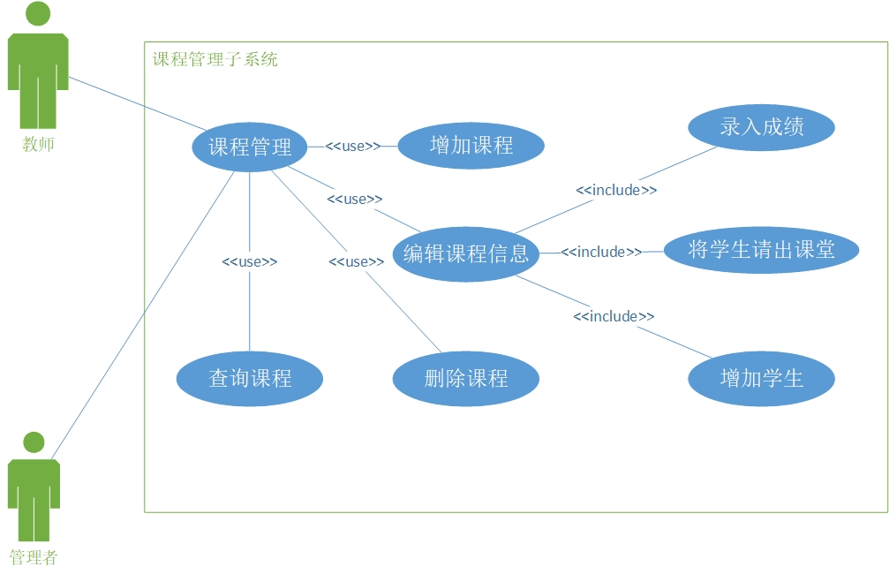

**需求分析报告**

版本：

编者*张心怡、杨格菲、平安东、李春梅* 2017年 10月 24日

审核 *程秀峰* 年 月 日

批准 *程秀峰* 年 月 日

目录
====

[需求分析报告 1](#_Toc496602789)

[一、 引言 4](#引言)

[1.1 编写目的 4](#编写目的)

[1.2 背景说明 4](#背景说明)

[1.3 预期读者和阅读建议 4](#预期读者和阅读建议)

[1.4 术语定义 5](#术语定义)

[二、 任务概述 6](#任务概述)

[2.1 目标 6](#目标)

[2.2 用户特点 6](#用户特点)

[2.3 假定和约束 6](#假定和约束)

[三、 业务功能概要描述 7](#业务功能概要描述)

[3.1 现有系统分析 7](#现有系统分析)

[3.2 业务描述 7](#业务描述)

[3.3 系统角色 8](#系统角色)

[3.4 主题描述（或：系统用例视图） 8](#主题描述或系统用例视图)

[3.5 业务流程图 9](#业务流程图)

[3.6 业务接口 10](#业务接口)

[3.6.1 外部业务接口 10](#外部业务接口)

[3.6.2 内部业务接口 11](#内部业务接口)

[四、 业务功能详细描述 11](#业务功能详细描述)

[4.1 用户管理子系统（模块一） 11](#用户管理子系统模块一)

[4.1.1 业务功能描述 11](#业务功能描述)

[4.1.2 业务流程图 11](#业务流程图-1)

[4.1.3 用户管理子系统用例视图 12](#用户管理子系统用例视图)

[4.1.4 用例描述 12](#用例描述)

[4.2 个人信息子系统（模块二） 13](#个人信息子系统模块二)

[4.2.1 业务功能描述 13](#业务功能描述-1)

[4.2.2 业务流程图 14](#业务流程图-2)

[4.2.3 用例视图 14](#用例视图)

[4.2.4 用例描述 15](#用例描述-1)

[4.3 课程管理子系统（模块三） 15](#课程管理子系统模块三)

[4.3.1 业务功能描述 15](#业务功能描述-2)

[4.3.2 业务流程图 16](#业务流程图-3)

[4.3.3 课程管理子系统用例视图 16](#课程管理子系统用例视图)

[4.3.4 用例描述 17](#用例描述-2)

[五、 性能要求 18](#性能要求)

[5.1 用户数要求 18](#用户数要求)

[5.2 业务方面的并发要求 18](#业务方面的并发要求)

[5.3 正常和极端情况下的时间要求 18](#正常和极端情况下的时间要求)

[5.4 容错要求 18](#容错要求)

[5.5 权限要求 19](#权限要求)

[5.6 灵活性要求 19](#灵活性要求)

[六、 其它需求 19](#其它需求)

引言
====

编写目的
--------

学校的现代化管理中，学生的考试管理是必不可少的一部分。考试管理的内容对于学校的管理是关重要的，所以，考试管理系统必须要为用户提供必要的信息和快捷的查询功能。

学生考试管理系统的详细设计，旨在确定应该怎样具体地实现所要求的系统。首先进行全面细致的用户需求分析，明确所要开发的系统应具有的功能、性能与界面，使系统分析人员及软件开发人员能清楚地了解用户的需求，并在此基础上进一步提出概要设计说明书和完成后续设计与开发工作。

本说明书在于清晰地指导最终用户、开发者完成对本系统规定的边界和目标，描述系统的功能性需求和非功能性需求。功能性需求即系统要实现的功能及概要的界面实现方式。非功能包含法律法规方面的约束和相关标准、系统的质量属性，包括可用性需求、可靠性需求、性能需求、可支持性需求以及其他需求。通过本文档定义的需求，以求在项目组成员与其他相关成员之间达成一致的需求描述。

背景说明
--------

学生考试管理系统是对学校教务和教学活动进行综合管理的平台系统，是一个学校和地区教育信息化的基础信息平台。满足学校管理层、学生、教师的日常工作、学习、查询、管理等工作，目的是共享学校各种信息，提高学校的工作效率、规范学校的工作流程、便利学生与老师的学习需要。

预期读者和阅读建议
------------------

| 预期读者           | 阅读建议                                                                                                              |
|--------------------|-----------------------------------------------------------------------------------------------------------------------|
| 领导成员           | 仔细阅读概述，编写目的，文档约定，系统功能需求描述、非功能需求与功能列表说明。                                        |
| 其他人员           | 仔细阅读文档约定，系统功能介绍需求描述、非功能需求、非功能需求与功能列表说明。 各个部门可重点阅读与本部门相关的内容。 |
| 参加需求评审的人员 | 仔细阅读与其评审侧重点相关的内容。                                                                                    |
| 系统设计人员       | 仔细阅读全部内容。                                                                                                    |
|  系统测试人员      | 仔细阅读全部内容 。                                                                                                   |
| 系统开发人员       | 仔细阅读全部内容。                                                                                                    |

术语定义
--------

**数据流图**：简称DFD，它从数据传递和加工角度，以图形方式来表达系统的逻辑功能、数据在系统内部的逻辑流向和逻辑变换过程，是结构化系统分析方法的主要表达工具及用于表示软件模型的一种。

**数据字典**：是指对数据的数据项、数据结构、数据流、数据存储、处理逻辑、外部实体等进行定义和描述，其目的是对数据流程图中的各个元素做出详细的说明。

**C**#：是微软为 .NET Framework量身订做的程序语言，微软公司在2000年6月发布的一种新的编程语言。C\#拥有C/C++的强大功能以及Visual Basic简易使用的特性，是第一个组件导向的程序语言，和C++与Java一样亦为对象导向程序语言。

**SQL：**（Structured Query Language）结构化查询语言，是一种数据库  查询和程序设计语言，用于存取数据以及查询、更新和管理关系数据库系统。同时也是数据库脚本文件的扩展名。

**ASP**.**NET**：是一项微软公司的技术，是一种使嵌入网页中的脚本可由特网服务器执行的服务器端脚本技术。

任务概述
========

目标
----

学生考试管理系统共分为三个大的模块：学生查询模块、教师成绩录入模块及管理员对各项信息管理模块。 

学  
生：通过输入学号、密码，验证通过后登录系统查询学籍信息、选课信息、考场安排信息、成绩与学分信息等，对以上的查询信息可以打印输出，并可以修改个人密码。 

教 
 师：通过输入老师帐号、密码，验证通过后登录系统，可以查询课程信息、老师基本信息等，可以录入学生成绩和修改密码。

管理员：学生管理（对学生进行增删改查）；教师管理（对教师进行增删改查）；考试管理（分配考试地点）；成绩管理（对学生成绩的增删改查）；所有账户的密码管理；个人密码修改。

用户特点
--------

描学生考试管理系统所需的数据量较大，不用层次的人所需查询的数据不同，所以系统的响应时间要非常快，查询效率要求高，能够及时响应不同层次所需的数据，因此系统必须要有高可靠性、高效率、稳定行、响应时间要快。

假定和约束
----------

本文档从以下几个方面对功能需求进行描述： 

①业务定义/描述。 

②适用的用户类型 

③业务规则/业务要素。 

④输入：提供所有与本功能有关的输入描述，包括：输入数据类型、格式、数值范围、精度、单位等。 

⑤输出：提供与本功能有关所有输出的描述，包括：输出数据类型、方式、格式、精度、单位等，以及图形或显示报告的描述。 

⑥业务操作流程。

业务功能概要描述
================

现有系统分析
------------

1.  华中师范大学教务管理系统

2.  描述：利用互联网络B/S管理系统模式，以网络为平台，设置学生信息管理，教师信息管理，课程信息管理，成绩信息管理，综合信息管理，系统管理六大功能模块，通过自动化信息处理方式对学校师生的教学课程信息进行一体化管理。其中，考试管理是教务管理系统的重要模块之一，现有功能包括课程考核标准设定，考试成绩录入，成绩明细查询等，满足了学校教学考核的一定要求。

3.  优势分析：功能设置较完备，从课程安排，学生选课，到评分设置，成绩录入形成一体化流程，且教师可得到班级成绩分布情况，学生课程结束后进行教学评价，形成双向监督，利于教学方式的改善提高。

4.  劣势分析：在课程排考时仍采用Excel和手工处理，数据繁杂易出现错误，且此平台在考试信息发布和成绩公布方面具有一定的功能缺失，无法发挥及时的提醒作用，而将现有的B/S管理系统模式转化为移动程序应用也成为了必然需求。

5.  华师大——微课程平台

6.  描述：华师大——微课程平台是服务于我校学子，拓宽知识面，培养艺术情操，助力全方位发展的素质课程在线学习平台。现有功能包括课程在线学习，课程在线考核，成绩明细查询等，为学生们提供了多元化的学习环境，丰富了课余学习生活。

7.  优势分析：网络课程学习方式和无纸化考试功能极大降低了人力和物资的投入，保证了考试的正规性及标准化。

8.  劣势分析：在线考核方式易导致作假、作弊、抄袭等恶劣现象出现，无法反映学生的真实学习情况。

业务描述
--------

考试管理作为综合教务系统的重要组成部分，主要由教务处负责，与各二级学院教务员共同协作，完成考试数据的安排和调整。

在保证学生老师信息、课程信息、选课数据和教室数据准确的基础上，教务处作为整个排考工作的枢纽，负责控制整个流程，制定考试安排计划，向学院和学生传达各项信息，以及安排和协调工作。

考试过程中主要涉及到的用户有：教务处、学院秘书、本科生、教师。涉及的主要业务包括：设置考试任务、设置考核方式、设置考试时段、管理考场容量、预设考试考场、批量安排考试、考试冲突检测、课程考场的综合查询及调整、监考人员管理、学生成绩的查询及导出打印。

系统角色
--------

管理者：主要由教务处考试管理人员和学院秘书组成。教务处是整个考试业务的主导，完成庞大的数据管理操作，包括考试科目的管理、考试教室的数据处理及考场分配、监考老师的分配、学生考场的安排等；学院秘书主要分担各学院的考试安排工作，帮助教务处共同完成考试数据的处理。

用户：主要由在校教师和学生组成。教师均需查看自己的监考安排，任课老师还需设置课程考核方式、制定评分标准、成绩录入系统。学生可以查询考试安排（包括考试地点、考试时间、考试科目、主考教师）及课程成绩，打印学业成绩。

主题描述（或：系统用例视图）
----------------------------

为实现考试管理各工作流的自动化、信息化和知识化，完成考试安排、数据管理、系统管理工作任务，现将考试信息管理系统分为三大子系统：用户管理子系统，课程考核管理子系统，个人信息管理子系统。

1.  用户管理子系统：主要包括用户管理和权限管理这两个用例。系统管理员拥有所有功能，把用户根据权限分为四类：教务处、学院秘书、教师、学生。管理员可以对这些用户进行查询、编辑、删除和增加操作。权限管理主要是用于管理员对不同层级的用户分配相应的功能菜单。

2.  个人信息子系统：主要用于个人信息管理。用户根据自己权限查看相应菜单，主要包括登录、注册、浏览课程信息、修改个人信息、密码更改这些功能。

3.  课程考核管理子系统：主要用于管理者和教师进行课程管理，以及管理员考试任务设置。课程管理包括查询、增加、删除课程，编辑课程信息这些功能。管理员根据课程的考核方式设定进行考试任务安排，主要包括考试任务增加、考试任务删除、考试任务修改，考试时间设定，考场设定，监考老师安排这些功能。

业务流程图
----------

通过建立图形，描述系统的整体结构。考试管理是一个比较复杂的业务流程，使用主要面向管理者和用户。基于数据库的后台管理，在不同权限条件下，系统参与者可浏览不同范围的相关信息。管理者包括教务处和学院秘书，可对学生、教师、课程信息、考试任务进行增删改查。用户包括教师和学生，教师主要负责编辑课程信息（增删课程、设置考核方式和评分标准），将成绩录入系统。在系统中添加相应课程后，学生可以查询考试安排及课程成绩，打印学业成绩。

业务接口
--------

### 外部业务接口

本系统可与教务管理系统、学生工作管理系统建立联系，形成一体化平台，满足师生多样化需求。

教务管理系统：主要用于学校对师生的教学课程信息进行全面管理，包括课程安排、自主选课、学分认定、教学评价、信息查询等功能，接入此系统可直接导入每学期课程安排和学生选课信息，减少了用户手动增删课程的繁重任务，简化操作流程。此外，课程成绩也能与教务管理系统达成共享，便于学校学院了解学生学习情况，并基于此进行适当的教学改革

学生工作管理系统：是学生管理工作的有效辅助工具，包括奖学金管理、困难生认定管理、勤工岗位申请管理、科技项目申报管理、就业信息管理等功能。学生课程成绩的跨平台共享将大大提高评奖评优，学生综合测评等工作的执行效率。

### 内部业务接口

考试管理信息系统各子系统自成模块，以用户管理子系统为基础，以考试安排、数据管理、系统管理为工作目标，对应设计课程考核管理子系统和个人信息子系统。参与者根据权限设置登录相应的功能菜单，可进行一定信息的增删查改，系统间数据传递通过触发设置在后台数据库进行。

业务功能详细描述
================

用户管理子系统（模块一）
------------------------

### 业务功能描述

用户管理子系统使管理员能完成用户管理功能后，完成增加用户、删除用户、编辑用户信息、查询用户的功能。

### 业务流程图

### 用户管理子系统用例视图

### 用例描述

管理者通过完成用户管理用例后，完成增加用户用例、删除用户用例、编辑用户信息用例、查询用户用例。

#### 用户管理-登录用例

管理者通过预设好的管理员账号登入系统。

#### 用户管理-浏览信息用例

管理者在登陆成功后，自动执行此用例，输出所用用户、课程信息。

#### 用户管理-增加用户

管理者在登录成功后，可执行此用例，创建用户名，增加一位用户，此用户密码为初始密码。

#### 用户管理-查询用户

管理者在登录成功后，可执行此用例，输入用户名，查询此用户，输出与此用户相关的一切信息。

#### 用户管理-删除用户

管理者在登录成功后，可执行此用例，输入用户名，删除数据库此用户的信息以及和此用户有关的关系。

#### 用户管理-编辑用户信息

管理者在登录成功后，可执行此用例，输入用户名，输出所有与此用户相关的信息，并可以对这些信息进行编辑。

个人信息子系统（模块二）
------------------------

### 业务功能描述

>   用户通过个人管理子系统，完成登录、注册、修改个人信息、浏览信息功能。

### 业务流程图

### 用例视图

### 用例描述

用户可通过个人管理用例浏览信息以及修改个人信息，个人管理用例包括注册用例，以及登录用例。

#### 个人管理-注册用例

用户以学号或者工号为用户名，自己设置账户密码，完成注册用例。

#### 个人管理-登录用例

用户使用已经通过注册用例的用户名以及密码进入系统。

#### 个人管理-浏览信息

用户在使用登录用例后自动使用此用例，查询并输出所有与用户相关数据

#### 个人管理-修改个人信息

用户在使用登录用例后，可自主修改个人其他信息。

课程管理子系统（模块三）
------------------------

### 业务功能描述

教师和管理员登陆成功后可用课程管理功能，其包括查询课程功能，增加课程功能，删除课程功能，编辑课程信息功能，编辑课程信息功能包括成绩的录入功能，为相应课程增加学生功能，以及为相应课程删除学生功能。

### 业务流程图

### 课程管理子系统用例视图

### 用例描述

教师和管理员登可用课程管理用例，其包括查询课程用例，增加课程用例，删除课程用例，编辑课程信息用例，编辑课程信息用例包括成绩录入用例，增加学生用例，以及删除学生用例。

#### 课程管理-查询课程用例

管理者或教师在登录成功后，可执行此用例，输入课程名，输出所有与此课程相关的信息。

#### 课程管理-增加课程用例

管理者或教师在登录成功后，可执行此用例，创建课程名，增加一项课程信息。

#### 课程管理-删除课程用例

管理者或教师在登录成功后，可执行此用例，输入课程名，删除此项课程以及与此课程的关系。

#### 课程管理-编辑课程信息-录入成绩用例

管理者或教师在登录成功后，选中某一课程后，可执行此用例，自动输出所用与此课堂相关的信息，并可以对每一项学生信息的成绩项进行编辑。

#### 课程管理-编辑课程信息-增加学生用例

管理者或教师在登录成功后，选中某一课程后，可执行此用例，输入学生用户名，将此学生信息项加入到此课堂信息中。

#### 课程管理-编辑课程信息-删除学生用例

管理者或教师在登录成功后，选中某一课程后，可执行此用例，输入学生用户名，清除此学生与此课堂的所有关系以及相关数据。

性能要求
========

用户数要求
----------

-   静态用户（注册用户）：20000以上

-   动态用户（在线用户）：2000以上

-   并发数：1000以上

业务方面的并发要求
------------------

-   系统在2000个用户的负载下，72小时内所有的功能可用及稳定；

-   系统在1500个用户、500个并发用户操作的负载下，72小时内系统的数据查询、数据更新、数据上传等功能可用及稳定；

-   系统在8.0G业务数据、1500个用户、500个并发用户操作的负载下，72小时内以上功能是可用及稳定的；

正常和极端情况下的时间要求
--------------------------

1.  响应时间：

-   最大响应时间不超过5秒

-   平均响应时间在1\~3秒以内

1.  更新处理时间：当数据发生变化时，如修改考场、修改学生个人信息等，后台数据更新处理时间不超过5分钟；

2.  数据装换和传送时间应在学生和老师能接受的范围内；

3.  故障处理时间不超过12小时；

容错要求
--------

1.  用户输错数据或者删除重要数据都有提示信息，具有较好的容错性能；

2.  正常使用时不应出错，若运行时遇到不可恢复的系统错误，也必须保证数据库完好无损；

3.  系统在使用的过程中所使用的计算机突然断电或者计算机系统崩溃，以及系统出现不可预测的BUG时，要求软件能够实时保护数据并存储，做到数据不能因故障而丢失；

权限要求
--------

用户主要包括三个人群：全体学生（包括本科生、研究生、博士生，以及外校辅修生）、全体在职教师和系统管理员（包括维修人员）。每个人群的权限分别为：

学生用户：

-   不能修改的信息：成绩，考场；

-   可修改个人信息（如：学号、姓名等）

教师用户：

-   能添加课程

-   规定考核方式（考察/考试）

-   可查看学生信息，但不能修改学生个人基本信息

系统管理员：能查看和修改所有信息

灵活性要求
----------

满足运行环境在允许操作系统之间的安全转换，当其同其他软件的接口发生变化时，只需做适当的调整即可，灵活性好。

其它需求
========

**6.1 安全性和可靠性要求**

1.  登录时，进行用户身份认证，只有合法用户才能登录使用系统，对每个用户都有权限设置；

2.  对登录名、密码、以及用户重要信息进行加密，保证账号信息安全；

3.  保证应用系统信息安全，防止内部机密或敏感信息的泄漏以及外部不良信息的侵入；

4.  进行信息加密和信息认证，防止突然或非法的访问、使用、修改数据或者泄密，确保穿过系统或网络的信息没有被修改；

5.  当系统发生故障时能够立即恢复，保证系统可靠运行；提供必要的冗余和备份措施，如：系统备份、数据库备份（包括定时后备，快速恢复）；

6.  能判断数据的有效性，屏蔽用户的错误出入，识别非法操作并进行提示；

7.  对异常及错误的日志记录，可追踪；

**6.2 软件质量保证要求**

1）可靠性：由于软件失效引起考场安排出错的概率应不超过5%；

2）健壮性：所有的考场安排都要指定一个缺省值，当输入数据丢失或无效时，就使用缺省值数据；

3）可维护性：遇到一般的小故障问题，系统可在短时间内自行修复；若遇到打的故障问题，可由维护人员进行故障扫除，保障系统在用户可接受的时间内，重新恢复工作；

4）有效性：系统能持续正常运行，而可供用户使用，平均可用时间72小时；

5）故障承受能力：系统在运行时，有可能会遇到故障，或者某些特定接口部分遭到侵害，在此情形下，系统要仍然保持基本的工作能力，从而避免彻底中断服务而造成更大的损失；

**6.3 兼容需求**

系统在不同硬件厂商的不同硬件配置、操作系统的环境下，以及和其它软件产品的接口连接上，能够正常运行，并达到一致效果。

**6.4业务规则**

1）只有在教师在系统中添加了课程，并填写了考核方式后，学生才能在系统中查看相关信息；

2）只有在输入了考核方式之后，才能进行考场安排。

3）考场安排时，一个课程相同班级的学生必须安排到同一个考场进行考试；

4）同一个时间段内，一个考场不能安排两场考试；

5）一门课程的教学老师不能监考这门课程的考试；

6）学生在一个考试时间内，不能有两场或以上的课程考试，只能有一门或没有考试，而且学生每天的考试安排要合理，一天内正常结课考试（不包括重修科目的考试）最多不超过4门；

7）只有教师在系统中录入了学生的考试成绩后，学生才能查看到自己的科目成绩；

8）教师录入完学生考试成绩后，若要修改成绩，必须先填写系统中的修改成绩申请，并说明修改成绩的理由和相关证明，只有申请通过之后，老师才能进行成绩的修改操作，而且只有一次修改机会；

**6.5 用户界面需求**

用户界面给人全新感觉，操作简单，试图优美等特性，并且采用菜单界面驱动方式，给操作用户带来了极大的便利，对用户友好。

操作界面简单明了，易于操作，对格式和数据类型限制的数据，进行验证，包括客户端验证和服务器验证，并采用错误提醒机制，提示用户输入正确数据和正确的操作系统。
